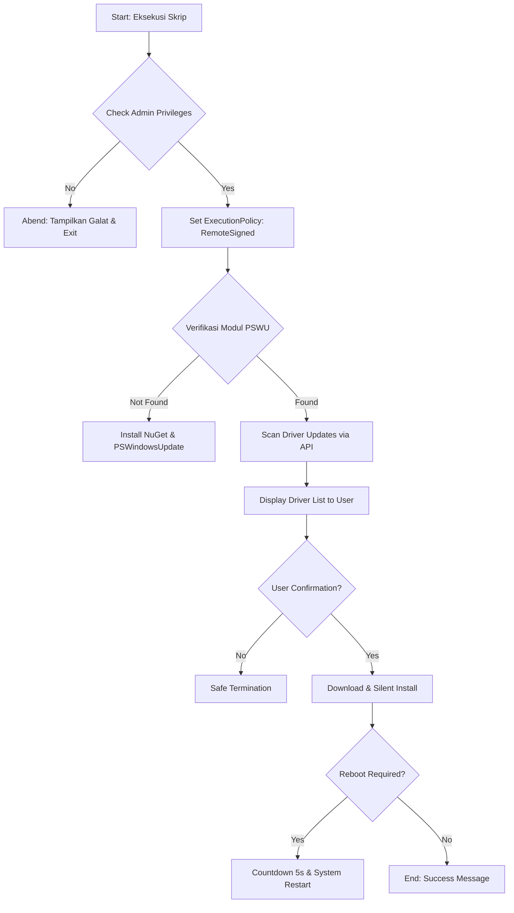

# INDRIV (Automated Windows Driver Updater)

**Kode Proyek:** INDRIV-2026
**Versi Dokumen:** 1.0.0
**Klasifikasi:** Publik (Open Source)
**Lisensi:** MIT License
**Tanggal Rilis:** 17 Agustus 2026

---

## 1. Pendahuluan dan Filosofi Desain

### 1.1 Visi Perangkat Lunak

**INDRIV** (*Windows Driver Automated Management & Installation Tool*) lahir dari kebutuhan akan standardisasi pemeliharaan infrastruktur *endpoint* berbasis Windows. Di lingkungan korporat maupun penggunaan personal tingkat lanjut, ketidaksesuaian versi driver (*driver drift*) seringkali menjadi penyebab utama degradasi performa, kerentanan keamanan, dan fenomena *Blue Screen of Death* (BSOD).

INDRIV bukan sekadar skrip, melainkan sebuah kerangka kerja (*framework*) ringan yang mengintegrasikan API Microsoft Windows Update dengan logika otomasi PowerShell untuk memberikan pengalaman pembaruan driver yang transparan, aman, dan tanpa hambatan.

### 1.2 Nilai Tambah Pengguna

* **Efisiensi Operasional:** Mengurangi waktu teknisi hingga 80% dalam melakukan survei dan instalasi driver manual.
* **Integritas Sistem:** Menggunakan sumber resmi (Microsoft Update Catalog) sehingga menjamin biner driver telah melalui sertifikasi WHQL (*Windows Hardware Quality Labs*).
* **Keamanan Terenkapsulasi:** Skrip beroperasi dalam *scope* proses terbatas, memastikan tidak ada perubahan permanen pada kebijakan keamanan global sistem di luar aktivitas pembaruan.

---

## 2. Arsitektur Teknis dan Logika Program

### 2.1 Alur Kerja High-Level (Sequential Workflow)

INDRIV beroperasi menggunakan metodologi *State-Check-Execute*. Berikut adalah detail dari setiap fase:



### 2.2 Deskripsi Komponen Modular

1. **Security Identity Validator:** Memanfaatkan kelas `[Security.Principal.WindowsIdentity]` untuk menginterogasi token akses proses. Ini adalah pertahanan pertama untuk mencegah kegagalan tulis pada direktori sensitif seperti `%WinDir%\System32\DriverStore`.

2. **Environment Sanitizer:** Mengisolasi lingkungan eksekusi dengan perintah `Set-ExecutionPolicy -ExecutionPolicy RemoteSigned -Scope Process`. Hal ini memungkinkan skrip menjalankan modul eksternal tanpa menurunkan postur keamanan sistem secara permanen.

3. **Dependency Resolver:** Mekanisme *self-healing* yang mendeteksi ketiadaan modul pihak ketiga. Skrip ini secara otomatis menghubungi repositori `PSGallery` untuk mengambil paket yang diperlukan, memastikan *zero-configuration* bagi pengguna akhir.

4. **Query Engine:** Menggunakan cmdlet `Get-WindowsUpdate` dengan filter `-IsDriver $true` untuk menyaring metadata dari ribuan update yang tersedia, memfokuskan hanya pada aset perangkat keras.

---

## 3. Spesifikasi Persyaratan Sistem (System Requirements)

Untuk menjamin reliabilitas eksekusi, sistem target harus memenuhi kriteria berikut:

| Kategori           | Spesifikasi Minimum         | Spesifikasi Rekomendasi                          |
| ------------------ | --------------------------- | ------------------------------------------------ |
| **Sistem Operasi** | Windows 10 (Build 19041+)   | Windows 11 atau Windows Server 2022              |
| **Arsitektur**     | x86, x64, ARM64             | x64 (64-bit)                                     |
| **PowerShell**     | Versi 5.1 (Desktop)         | PowerShell 7.x (Core) untuk performa lebih cepat |
| **Akses Jaringan** | Internet (HTTP/HTTPS)       | Akses stabil tanpa proxy SSL-interception        |
| **Ruang Disk**     | 500 MB (untuk cache driver) | 2 GB+ (untuk driver grafis/chipset besar)        |
| **Privilese**      | Administrator Lokal         | Administrator Sistem atau SYSTEM Account         |

---

## 4. Panduan Implementasi dan Penggunaan

### 4.1 Persiapan Pra-Eksekusi

Pastikan koneksi internet aktif. Jika berada di lingkungan perusahaan, pastikan domain berikut tidak diblokir oleh Firewall:

* `*.powershellgallery.com`
* `*.windowsupdate.com`
* `*.microsoft.com`

### 4.2 Prosedur Eksekusi

1. Klik kanan pada tombol Start, pilih **Windows Terminal (Admin)** atau **PowerShell (Admin)**.

2. Eksekusi perintah pemanggilan skrip:

```powershell
# Contoh eksekusi jika skrip berada di folder Downloads
Set-Location -Path "$env:USERPROFILE\Downloads"
.\INDRIV.ps1
```

### 4.3 Navigasi Antarmuka Pengguna

1. **Tahap Audit:** Skrip akan menampilkan tabel berisi: `ComputerName`, `Status`, `KB`, dan `Title` driver.

2. **Keputusan Instalasi:** Anda akan melihat prompt:

   `Apakah Anda ingin melanjutkan instalasi driver? (Y/N)`

   * Tekan **Y** untuk memulai proses unduhan paralel.

3. **Finalisasi:** Jika instalasi memerlukan *reboot* (seringkali pada driver Chipset/BIOS), sistem akan memberikan peringatan sebelum melakukan *restart* paksa dalam waktu 5 detik untuk memastikan perubahan diterapkan pada level kernel.

---

## 5. Penanganan Kesalahan dan Protokol Keamanan

### 5.1 Manajemen Eksepsi (Exception Handling)

INDRIV menggunakan blok `Try-Catch-Finally` yang redundan. Jika terjadi kegagalan jabat tangan (*handshake*) TLS dengan server Microsoft, skrip akan memberikan pesan diagnostik yang jelas daripada berhenti secara mendadak (*crash*).

### 5.2 Logika Keamanan (Safety Logic)

* **No Payload Policy:** INDRIV tidak mengandung biner pihak ketiga. Semua modul diunduh langsung dari sumber resmi Microsoft/PowerShell Gallery.
* **Audit Trail:** Seluruh aktivitas terekam dalam *session log* PowerShell yang dapat dipipa (*piped*) ke file `.log` untuk keperluan audit IT.

---

## 6. Pemeliharaan dan Dukungan (Maintenance)

### 6.1 Pembaruan Skrip

Karena ketergantungan pada API Windows Update, disarankan untuk memeriksa pembaruan skrip INDRIV setiap 6 bulan guna menyesuaikan dengan perubahan skema modul `PSWindowsUpdate`.

### 6.2 Kontribusi dan Lisensi

Proyek ini bersifat sumber terbuka di bawah **Lisensi MIT**.

* **Modifikasi:** Diizinkan secara penuh.
* **Distribusi:** Diizinkan dengan menyertakan atribusi penulis asli.
* **Garansi:** Perangkat lunak disediakan "sebagaimana adanya" (*as-is*), tanpa jaminan dalam bentuk apa pun.

---

**Dokumentasi ini disusun oleh Pengembang INDRIV.**
*© 2026 INDRIV Project. Merdeka dalam Otomasi Sistem.*
